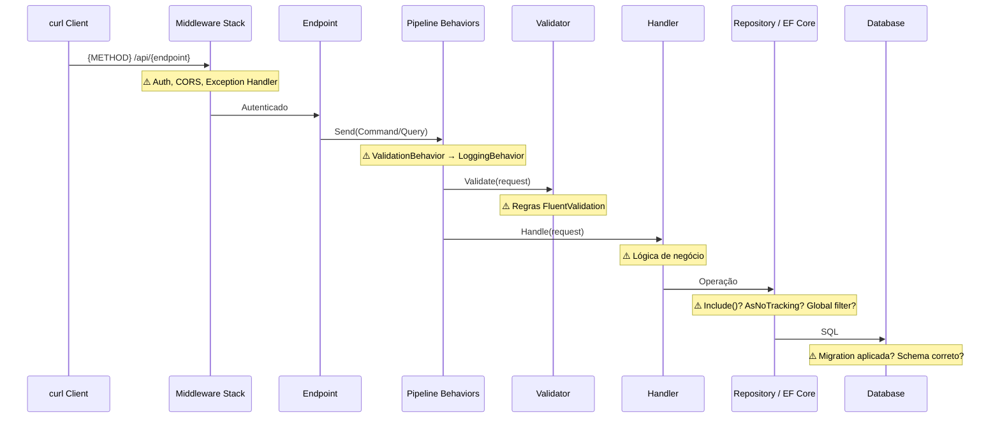

# Debug Problem

## Overview
Systematic, evidence-based debugging. The goal is to understand WHY something
is broken before touching any code. Skipping to a fix without reproducing the
problem almost always leads to patches that mask the real issue.

---

## Phase 1: COLETA DE CONTEXTO (não modifique nenhum código)

1. Leia a mensagem de erro, stack trace ou descrição fornecida
2. Identifique o componente afetado (endpoint/handler/serviço, camada)
3. Leia os arquivos de código relevantes
4. Verifique mudanças recentes:
   ```bash
   git log --oneline -20
   git diff HEAD~3..HEAD --stat
   ```
5. Verifique se há testes existentes para essa área:
   ```bash
   find tests/ -name "*{Component}*" | head -10
   ```
6. Leia configurações: `appsettings.json`, `appsettings.Development.json`, `.env`
7. Verifique migrations pendentes:
   ```bash
   dotnet ef migrations list --project src/Infrastructure --startup-project src/Api 2>/dev/null | tail -5
   ```
8. Verifique logs recentes:
   ```bash
   docker compose logs api --tail=100 2>/dev/null || true
   ```

Produza um resumo: "O problema parece estar em {componente}, afetando {endpoint/fluxo}. O erro: {descrição}."

---

## Phase 2: HIPÓTESES (5-7 causas raiz)

Liste possíveis causas ordenadas por probabilidade:

| # | Hipótese | Prob. | Evidência Necessária |
|---|---------|-------|----------------------|
| 1 | {mais provável} | Alta | {o que verificar} |
| 2 | ... | Média | ... |

**Categorias comuns em .NET — use como checklist mental:**

*Runtime:*
- **NullReferenceException**: null checks ausentes, navigation properties não carregadas (`.Include()` faltando)
- **DI errors**: registro ausente, lifetime errado (Scoped em Singleton), interface não registrada
- **Async/await**: await faltando, deadlock com `.Result`/`.Wait()`, `DbContext` descartado antes do uso
- **Serialização**: referência circular, `JsonConverter` faltando, camelCase vs PascalCase

*Dados / EF Core:*
- **N+1 queries**: loop que dispara SELECT para cada item sem `Include()` ou batching
- **Tracking issues**: entidade modificada fora do DbContext, `AsNoTracking` em local errado
- **Concurrency**: `DbUpdateConcurrencyException`, `RowVersion` conflitando
- **Migration não aplicada**: schema do banco desatualizado vs modelo do código

*API / Infraestrutura:*
- **Ordem de middleware**: CORS antes de Auth, Exception handler fora de ordem
- **Validação**: `FluentValidation` não registrado, `ValidationBehavior` ausente no pipeline
- **Configuração**: chave ausente no `appsettings`, `ConnectionString` errada, variável de ambiente faltando
- **Auth**: policy não registrada, claim ausente, JWT expirado, audience/issuer errados

*Performance:*
- **Slow queries**: índice ausente, LINQ que gera SQL ineficiente
- **Memory leak**: objeto grande em memória, event handler não desregistrado, Singleton com DbContext

**STOP: Apresente as hipóteses ao usuário. Pergunte se alguma pode ser descartada.**

---

## Phase 3: DIAGNÓSTICO COM CURL

Certifique-se que a API está rodando antes de executar.

```bash
# Verificar saúde
curl -s -o /dev/null -w "Health: %{http_code}\n" http://localhost:5000/health

# Requisição completa com verbose
curl -v -X {METHOD} "http://localhost:5000/api/{endpoint}" \
  -H "Content-Type: application/json" \
  -H "Authorization: Bearer $TOKEN" \
  -d '{body}' 2>&1 | tee /tmp/debug-response.txt

# Status code + tempo de resposta
curl -s -o /dev/null -w "HTTP %{http_code} | %{time_total}s\n" \
  -X {METHOD} "http://localhost:5000/api/{endpoint}" \
  -H "Content-Type: application/json" \
  -d '{body}'

# Response formatado (ProblemDetails)
curl -s -X {METHOD} "http://localhost:5000/api/{endpoint}" \
  -H "Content-Type: application/json" \
  -d '{body}' | jq '{status,title,detail,errors}'

# Payload mínimo para isolar o gatilho
curl -s -X POST "http://localhost:5000/api/{endpoint}" \
  -H "Content-Type: application/json" \
  -d '{"campo": "valor_minimo"}' | jq '.'
```

**Coletar logs com EF Core SQL logging:**
```bash
# Terminal 1 — rodar com logging completo incluindo SQL gerado
ASPNETCORE_ENVIRONMENT=Development \
Logging__LogLevel__Default=Debug \
Logging__LogLevel__Microsoft.EntityFrameworkCore.Database.Command=Information \
Logging__LogLevel__Microsoft.EntityFrameworkCore.Query=Warning \
dotnet run --project src/{Project}.Api

# Terminal 2 — disparar a requisição
curl -v http://localhost:5000/api/{endpoint} -d '{...}'

# Docker
docker compose logs -f api --tail=100
docker compose logs api 2>&1 | grep -iE "error|exception|warn|fail" | tail -30
```

**Analisar o SQL gerado (N+1 e slow queries):**
```bash
# Filtrar queries lentas nos logs (> 100ms)
docker compose logs api 2>&1 | grep -i "executed dbcommand" | grep -v "ms\|0 ms\|1 ms\|2 ms"

# Contar total de queries numa requisição (N+1 detector manual)
# Capture os logs de uma chamada e conte linhas com "SELECT"
```

**Analise as evidências:**
- Status HTTP esperado vs real
- Headers de resposta (Content-Type, correlation IDs, WWW-Authenticate)
- Body de erro: validation errors, stack traces, exception type
- SQL queries geradas: há N+1? Há tabela errada? Filtros corretos?
- Tempo de resposta: > 500ms sugere problema de performance

---

## Phase 4: TRACE DO FLUXO

Mapeie o caminho pelo código e marque onde quebra:



Marque com ❌ o ponto exato onde o fluxo quebra.

---

## Phase 5: REPRODUZIR COM TESTE

```csharp
[Fact]
public async Task Handle_WhenBugCondition_ReproducesReportedFailure()
{
    // Arrange — configure exatamente a condição que causa o bug
    var command = new {Command}(/* inputs que disparam o bug */);

    // Act + Assert — este teste deve FALHAR com o mesmo erro reportado
    var result = await _sut.Handle(command, CancellationToken.None);
    result.IsError.Should().BeTrue();
    result.FirstError.Description.Should().Contain("{mensagem de erro}");
    // ou:
    // var act = () => _sut.Handle(command, CancellationToken.None);
    // await act.Should().ThrowAsync<{ExceptionType}>().WithMessage("*{msg}*");
}
```

Execute e confirme que falha com **o mesmo erro** reportado pelo usuário.
Se o teste passar (não reproduziu): reavalie as hipóteses.

---

## Phase 6: CORREÇÃO

1. Explique a causa raiz ao usuário (o que, por que, o que o fix faz)
2. Implemente o mínimo de mudança
3. Execute o teste de reprodução — deve passar
4. Execute a suite completa: `dotnet test` — zero regressões
5. Remova logging temporário adicionado durante diagnóstico
6. Verifique com curl:
   ```bash
   curl -v -X {METHOD} "http://localhost:5000/api/{endpoint}" \
     -H "Content-Type: application/json" \
     -d '{mesma requisição que falhava}'
   ```

**Fixes comuns por categoria:**

*N+1 queries:*
```csharp
// Antes (N+1)
var orders = await _context.Orders.ToListAsync();
foreach (var order in orders)
    _ = order.Items; // dispara SELECT para cada order

// Depois
var orders = await _context.Orders.Include(o => o.Items).ToListAsync();
```

*DI Lifetime:*
```csharp
// Scoped em Singleton causa ObjectDisposedException
// Antes: services.AddSingleton<IMyService, MyService>(); com DbContext injetado
// Depois: services.AddScoped<IMyService, MyService>();
// ou use IServiceScopeFactory no Singleton
```

*Async deadlock:*
```csharp
// Antes (deadlock em contextos síncronos)
var result = service.GetDataAsync().Result;
// Depois
var result = await service.GetDataAsync();
```

*Migration não aplicada:*
```bash
dotnet ef database update --project src/Infrastructure --startup-project src/Api
```

---

## Phase 7: PREVENIR

1. Converta o teste de reprodução em regressão permanente
2. Adicione logging em Warning/Error para situações similares:
   ```csharp
   _logger.LogWarning("Entidade {EntityId} não encontrada para {UserId}",
       command.EntityId, command.UserId);
   ```
3. Considere guards ou validações adicionais
4. Commit:
   ```bash
   git add -A
   git commit -m "fix({scope}): {descrição do que foi corrigido}

   Causa raiz: {explicação breve}
   Previne: {o que este fix evita}"
   ```

---

## Output
- Causa raiz (2-3 frases)
- Arquivos modificados
- Teste adicionado (nome e o que verifica)
- Curl para verificar o fix

## Guardrails
- NÃO modifique código nas Phases 1-2 (apenas análise)
- NÃO pule o teste de reprodução da Phase 5
- Se não conseguir reproduzir após 3 tentativas: PARE e peça mais contexto
- Sempre remova código de debug temporário antes do commit
- Se o bug estiver em componente compartilhado: informe blast radius antes de corrigir
- Se a causa raiz exigir mudança arquitetural: apresente análise e peça aprovação
- Para N+1: sempre verifique o SQL gerado antes de propor fix
