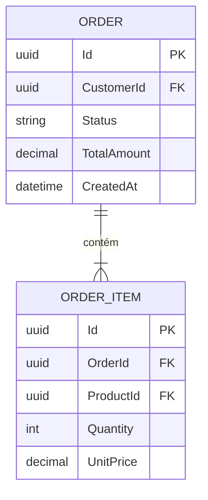
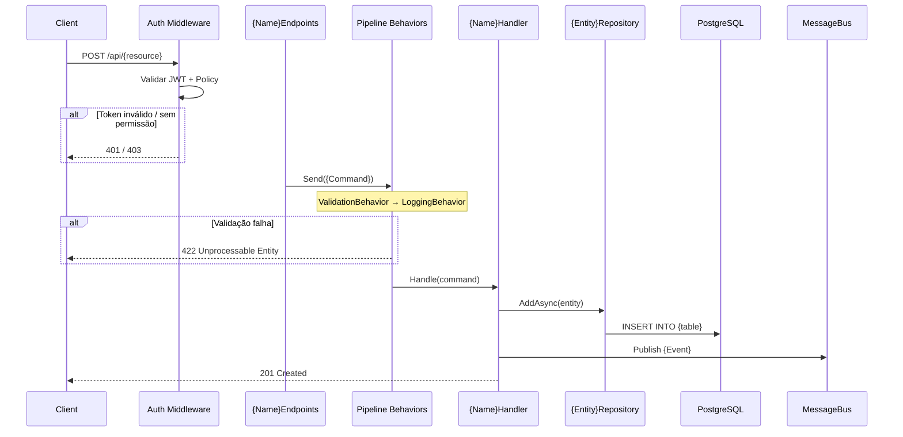
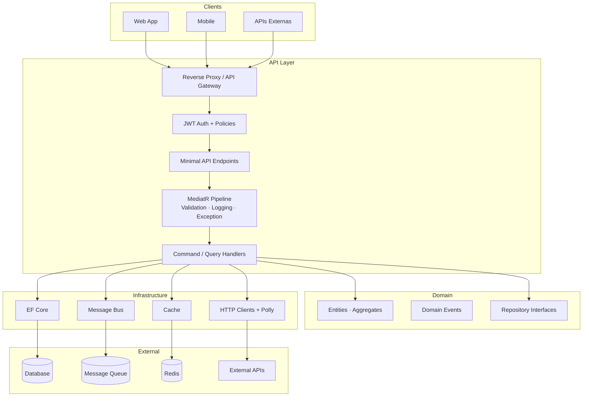

# Init Documentation

## Overview
Analyze the entire .NET API codebase and produce structured, navigable
documentation for every endpoint and flow. Good documentation is a map — any
developer should understand what an endpoint does, what it depends on, and what
it produces without reading the source code.

---

## Phase 1: ESCANEAMENTO DO PROJETO

```bash
# Estrutura e versão
find . -name "*.sln" | head -3
cat global.json 2>/dev/null || true
find src/ -name "*.csproj" | head -10

# Encontrar todos os endpoints
grep -rn "MapGet\|MapPost\|MapPut\|MapDelete\|MapPatch" src/ --include="*.cs" -l
grep -rn "\[HttpGet\]\|\[HttpPost\]\|\[HttpPut\]\|\[HttpDelete\]" src/ --include="*.cs" -l
grep -rn "ICarterModule\|AddRoutes\|FastEndpoints" src/ --include="*.cs" -l

# DbContext e entidades
find src/ -name "*DbContext*.cs" | head -5
grep -rn "DbSet<" src/ --include="*.cs"

# HTTP externos
grep -rn "HttpClient\|IHttpClientFactory\|AddHttpClient" src/ --include="*.cs" -l

# Filas
grep -rn "IPublishEndpoint\|ISendEndpointProvider\|IServiceBusSender\|IConsumer<" src/ --include="*.cs" -l

# Cache
grep -rn "IMemoryCache\|IDistributedCache\|IConnectionMultiplexer\|HybridCache" src/ --include="*.cs" -l

# OpenTelemetry / Observabilidade
grep -rn "ActivitySource\|AddOpenTelemetry\|ILogger\|Serilog" src/ --include="*.cs" -l | head -5

# Multitenancy
grep -rn "ITenantContext\|HasQueryFilter.*Tenant\|TenantId" src/ --include="*.cs" -l 2>/dev/null
```

Produza o inventário de endpoints:
| Método | Rota | Arquivo | Handler/Command | Auth |
|--------|------|---------|-----------------|------|

---

## Phase 2: MAPEAMENTO DE DEPENDÊNCIAS

Para cada endpoint, trace a cadeia completa:

**Banco de Dados:**
- `DbSet<T>` no DbContext → nome real da tabela (via `IEntityTypeConfiguration<T>`)
- Operações: SELECT, INSERT, UPDATE, DELETE
- Global query filters ativos (multitenancy, soft-delete)

**HTTP Externas:**
- Typed clients → base URL (do `appsettings.json`)
- Política Polly associada (retry, circuit breaker, timeout)

**Filas de Mensagens:**
- MassTransit: `IPublishEndpoint.Publish<T>()` → evento publicado
- MassTransit: `IConsumer<T>` → evento consumido
- Azure Service Bus / RabbitMQ: nomes de tópicos/queues do `appsettings.json`

**Cache:**
- `IMemoryCache`, `IDistributedCache`, Redis: chave + TTL + operação (READ/WRITE/INVALIDATE)

**Observabilidade:**
- `ActivitySource` usados (OpenTelemetry traces)
- `_logger.Log{Level}` calls relevantes por endpoint
- Métricas expostas (se `Meter` for usado)

---

## Phase 3: GERAR DOCUMENTAÇÃO

### 3.1 Índice Global — `docs/api/README.md`

```markdown
# Documentação da API — {Project Name}

**Versão:** {versão do projeto}  **SDK:** .NET {versão}
**Documentação interativa:** `/scalar/v1` (desenvolvimento)

## Autenticação
Bearer token JWT. Header: `Authorization: Bearer {token}`
Expiração: {tempo}. Renovação: {endpoint ou instrução}.

## Endpoints

| Método | Rota | Descrição | Auth |
|--------|------|-----------|------|
| POST | /api/orders | Criar pedido | Sim |

## Formato de Erro Padrão (RFC 7807)
```json
{
  "type": "https://tools.ietf.org/html/rfc7807",
  "title": "Validation Error",
  "status": 422,
  "detail": "Um ou mais erros ocorreram.",
  "errors": { "campo": ["mensagem"] }
}
```

## Domínios
- [Orders](./orders.md)
- [Products](./products.md)
```

### 3.2 Por Domínio — `docs/api/{domain}.md`

```markdown
# {Domínio} API

## Visão Geral
{1-2 frases sobre o que este domínio gerencia}

## Modelo de Dados


---

## POST /api/{resource}
**{Descrição em uma linha}**

### Fluxo


### Autenticação
{Obrigatória / Pública} — Policy: `{nome-da-policy}`
{Se multitenancy: "Acesso restrito ao tenant do token."}

### Request
```json
{ "campo": "valor" }
```
| Campo | Tipo | Obrigatório | Validações |
|-------|------|-------------|------------|
| campo | string | Sim | NotEmpty, máx 200 |

### Response
**201 Created**
```json
{ "id": "guid" }
```

**Erros:**
| Status | Condição |
|--------|----------|
| 400 | JSON malformado |
| 401 | Token ausente/inválido |
| 403 | Sem permissão (policy) |
| 422 | Erros de validação |
| 409 | Conflito de negócio |

### Dependências
| Tipo | Alvo | Operação | Detalhes |
|------|------|----------|----------|
| Banco | `orders` | INSERT | Criação principal |
| Banco | `order_items` | INSERT | N itens |
| Banco | `products` | SELECT | Verificação de estoque |
| Fila | `order-created` | PUBLISH | `OrderCreatedEvent` |
| Cache | `product:{id}` | READ | TTL: 5min |
| HTTP | `{ExternalApi}` | POST | Polly: retry 3x + circuit breaker |

### Observabilidade
| Tipo | Detalhes |
|------|----------|
| Log (Info) | `"Order {OrderId} criado para Customer {CustomerId}"` |
| Log (Warn) | `"Produto {ProductId} sem estoque"` |
| Trace | Activity `orders.create` com tags `order.id`, `customer.id` |
```

### 3.3 Arquitetura — `docs/architecture/overview.md`

```markdown
# Visão Geral da Arquitetura

**SDK:** .NET {versão} | **Padrão:** {Clean Architecture / Vertical Slice}
**Banco:** {PostgreSQL / SQL Server / SQLite}
**Message Broker:** {RabbitMQ / Azure Service Bus / nenhum}
**Cache:** {Redis / InMemory / nenhum}


```

### 3.4 Guia de Contribuição — `docs/CONTRIBUTING.md`

```markdown
# Guia de Contribuição

## Pré-requisitos
- .NET SDK {versão} (`global.json` define a versão exata)
- Docker Desktop (para Testcontainers e ambiente local)
- {Ferramentas adicionais}

## Setup Local
```bash
git clone {repo}
cd {projeto}
cp appsettings.Development.json.example appsettings.Development.json
# Edite appsettings.Development.json com suas configs locais
docker compose up -d  # Sobe banco e dependências
dotnet ef database update --project src/Infrastructure --startup-project src/Api
dotnet run --project src/Api
```

## Workflow de Desenvolvimento
1. Crie branch: `git checkout -b feat/nome-da-feature`
2. Use `init-feature` para planejar antes de codificar
3. Use `feature-build` para implementar seguindo o plano
4. Use `finish-feature` como quality gate antes do PR

## Padrões
- **Commits:** Conventional Commits (`feat:`, `fix:`, `docs:`, `refactor:`, `test:`)
- **Branch:** `feat/`, `fix/`, `docs/`, `chore/`
- **PR:** mínimo 1 reviewer, todos os checks passando

## Testes
```bash
dotnet test                         # Todos os testes
dotnet test --filter "Category=Unit"       # Apenas unitários
dotnet test --filter "Category=Integration" # Apenas integração
```

## Variáveis de Ambiente
| Variável | Descrição | Exemplo |
|----------|-----------|---------|
| `ConnectionStrings__Default` | String de conexão com o banco | `Host=localhost;...` |
| `Jwt__Secret` | Chave secreta JWT | Mínimo 32 chars |
| `{OUTRA_VAR}` | {descrição} | {exemplo} |
```

### 3.5 Runbook de Operações — `docs/runbook.md`

```markdown
# Runbook de Operações

## Health Checks
```bash
curl http://{host}/health          # Status geral
curl http://{host}/health/live     # Liveness (app rodando?)
curl http://{host}/health/ready    # Readiness (dependências ok?)
```

## Variáveis de Ambiente (produção)
| Variável | Obrigatório | Descrição |
|----------|-------------|-----------|
| `ConnectionStrings__Default` | Sim | String de conexão principal |
| `Jwt__Issuer` | Sim | Emissor do JWT |
| `Jwt__Audience` | Sim | Audiência do JWT |
| `Jwt__SecretKey` | Sim | Chave secreta (≥ 32 chars) |

## Migrations em Produção
```bash
# Gerar script SQL (não aplica direto)
dotnet ef migrations script --idempotent \
  --project src/Infrastructure \
  --startup-project src/Api \
  --output migration.sql

# Revisar migration.sql antes de executar no banco de produção
```

## Rollback de Feature
```bash
# Reverter a última migration
dotnet ef database update {PreviousMigrationName} \
  --project src/Infrastructure --startup-project src/Api

# Reverter código
git revert {commit-hash}
```

## Observabilidade
- **Logs:** {Kibana / Seq / Application Insights} — filtro: `application="{nome}"`
- **Traces:** {Jaeger / Zipkin / Application Insights} — trace ID no header `X-Trace-Id`
- **Métricas:** {Prometheus / Azure Monitor} — dashboard: {link}

## Problemas Comuns
| Sintoma | Causa Provável | Ação |
|---------|---------------|------|
| 503 em /health/ready | Banco inacessível | Verificar connection string e firewall |
| JWT 401 sem expiração | Issuer/Audience errado | Verificar variáveis Jwt__ |
| Slow queries | Migration não aplicada | Executar `migrations script` e revisar |
```

---

## Phase 4: VALIDAÇÃO

```bash
# Contar endpoints documentados vs existentes no código
echo "Documentados:"
grep -c "^## [A-Z]* /api/" docs/api/*.md 2>/dev/null || echo 0

echo "No código:"
grep -rn "MapGet\|MapPost\|MapPut\|MapDelete\|MapPatch" src/ --include="*.cs" | wc -l
```

- [ ] Todos os endpoints do inventário documentados
- [ ] Schemas de request/response conferem com os DTOs reais
- [ ] Mapeamento de dependências verificado contra o código
- [ ] Nenhuma informação inventada — somente o que está no código
- [ ] `docs/CONTRIBUTING.md` cobre setup local completo
- [ ] `docs/runbook.md` cobre variáveis de ambiente e migrations

Se dependências incertas: marque como `⚠️ Necessita verificação`

---

## Output

Arquivos criados:
- `docs/api/README.md` — índice global
- `docs/api/{domain}.md` — por domínio com Mermaid e dependências
- `docs/architecture/overview.md` — diagrama de arquitetura
- `docs/CONTRIBUTING.md` — guia de contribuição e setup local
- `docs/runbook.md` — operações, env vars, migrations, rollback

```bash
git add docs/
git commit -m "docs(api): gerar documentação completa com diagramas, runbook e guia de contribuição"
```

---

## Guardrails
- NÃO invente schemas — leia os DTOs reais
- NÃO documente endpoints internos sem solicitação explícita
- Se endpoint sem DTOs claros: documente o verificável, marque o resto com `⚠️`
- Máximo 30 endpoints por execução — para APIs maiores, pergunte quais domínios priorizar
- Inclua observabilidade (logs/traces) somente se encontrado no código
- Se projeto usar XML comments (`<summary>`): incorpore-os na documentação
