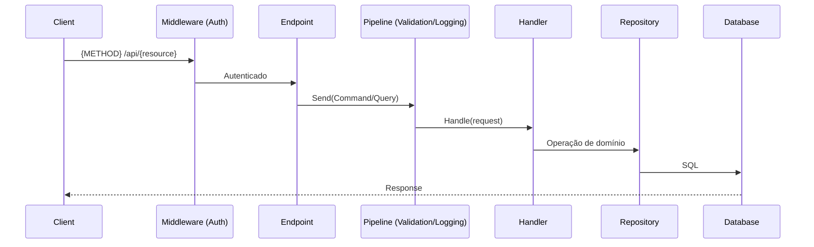

# Init Feature

## Overview
Analyze the existing .NET codebase, understand its architecture, ask the right
questions, then produce a complete specification package with failing tests that
encode the acceptance criteria (TDD Red phase). No implementation code is
written during this skill — only specs, plans, and test stubs.

---

## Phase 1: CODEBASE ANALYSIS

### 1.1 Contexto geral do projeto
```bash
cat CLAUDE.md 2>/dev/null || echo "CLAUDE.md not found"
find . -name "*.sln" | head -3
cat global.json 2>/dev/null || find . -name "global.json" | head -2
```
- Extraia do `CLAUDE.md`: arquitetura, convenções, stack de testes
- Verifique a versão do .NET via `global.json` ou `<TargetFramework>` nos `.csproj`
  - .NET 6/7: middleware para exception handling, sem keyed services
  - .NET 8+: `IExceptionHandler`, `IProblemDetailsService`, keyed DI disponíveis
  - .NET 9+: `HybridCache`, `OpenApi()` nativo, melhorias em Minimal API

### 1.2 Detecção de arquitetura
```bash
find src/ -type d | head -60
find src/ -name "*.csproj" | xargs grep -l "MediatR\|Carter\|FastEndpoints\|Wolverine" 2>/dev/null
grep -rn "IRequest<\|IRequestHandler\|ICommand\|IQuery" src/ --include="*.cs" -l 2>/dev/null | head -5
grep -rn "MapGet\|MapPost\|ICarterModule\|\[ApiController\]" src/ --include="*.cs" -l 2>/dev/null | head -5
```

Sinais mapeados:
- `IRequest<T>`, `IRequestHandler` → CQRS/MediatR
- `MapGet/MapPost` em `WebApplication` → Minimal API
- `Domain/`, `Application/`, `Infrastructure/` → Clean Architecture
- `Features/` com subpastas verticais → Vertical Slice
- `[ApiController]` → MVC tradicional
- `ICarterModule` → Carter
- `ICommandHandler<T>` sem MediatR → CQRS manual

**Se a arquitetura não puder ser determinada, STOP e pergunte:**
> "Não consegui identificar o padrão com clareza. Qual seguimos?
> (a) Clean Architecture + CQRS/MediatR  (b) Vertical Slice  (c) DDD puro  (d) Outro"

### 1.3 Conventions mining — aprenda com features existentes
Abra **uma feature completa** existente e extraia os padrões reais do projeto:

```bash
find src/ -path "*/Features/*" -name "*.cs" | head -15
find tests/ -name "*HandlerTests.cs" -o -name "*CommandTests.cs" | head -5
```

Extraia especificamente:
- **Result pattern**: `ErrorOr<T>`, `Result<T>` (FluentResults), `OneOf`, ou `ValidationResult`
- **Unit of Work**: `IUnitOfWork.SaveChangesAsync()` ou `DbContext.SaveChangesAsync()` direto
- **Domain events**: `IPublisher.Publish()`, Outbox pattern, ou `AddDomainEvent()`
- **Pipeline behaviors**: `ValidationBehavior`, `LoggingBehavior`, `ExceptionBehavior`
- **DI registration**: como serviços são registrados (`DependencyInjection.cs`, extensions, etc.)
- **Test conventions**: `_sut`, nomenclatura `Method_Condition_Expected`, AAA comments

### 1.4 Detecção de infraestrutura existente
```bash
grep -rn "IPublishEndpoint\|ISendEndpointProvider\|IServiceBusSender" src/ --include="*.cs" -l 2>/dev/null
grep -rn "IMemoryCache\|IDistributedCache\|IConnectionMultiplexer\|HybridCache" src/ --include="*.cs" -l 2>/dev/null
grep -rn "HasQueryFilter\|ITenantContext\|TenantId\|_tenantId" src/ --include="*.cs" -l 2>/dev/null
grep -rn "AddResiliencePipeline\|AddPolicyHandler\|ResiliencePipeline" src/ --include="*.cs" -l 2>/dev/null
```
Registre o que encontrou — será usado no mapeamento de dependências.

### 1.5 Verificar features similares (evitar duplicação)
```bash
grep -rn "{palavra-chave-da-feature}" src/ --include="*.cs" -l 2>/dev/null | head -10
```
Se encontrar feature similar existente, compare escopos e informe o usuário antes de prosseguir.

---

## Phase 2: DISCOVERY QUESTIONS

Agrupe as perguntas e aguarde as respostas — elas moldam todo o spec.

**Contexto de negócio:**
- Qual é a user story? (Como [papel], quero [ação], para que [benefício])
- Quais os critérios de aceite? (formato Dado/Quando/Então preferido)
- Quais cenários de erro e edge cases devem ser cobertos?

**Escopo técnico:**
- Quais entidades/agregados estão envolvidos? Novos ou existentes?
- Quais tabelas precisam ser criadas ou modificadas?
- Há chamadas HTTP externas, eventos em filas, ou uso de cache?
- Idempotência requerida? (operação repetível com mesmo resultado)
- Quais regras de auth se aplicam? (política, roles, resource-based)

**Restrições:**
- Requisito de performance? (tempo de resposta, throughput, SLA)
- Requisitos não-funcionais? (LGPD, auditoria, soft-delete, multitenancy)
- Necessidade de Outbox pattern? (consistência eventual com filas)

**STOP — aguarde as respostas antes de continuar.**

---

## Phase 3: SOFTWARE DESIGN DOCUMENT

Crie `docs/design/FEAT-{kebab-name}/sdd.md`:

```markdown
# {Nome da Feature} — Software Design Document

**Autor:** {user}  **Status:** Draft  **Data:** {YYYY-MM-DD}  **SDK:** .NET {versão}

## 1. Visão Geral
Um parágrafo: o que essa feature faz e por que é necessária.

## 2. Objetivos
- Objetivo 1 (mensurável)

## 3. Fora de Escopo
Declare explicitamente o que NÃO está incluído.

## 4. Design Proposto

### 4.1 Fluxo da Requisição


### 4.2 Modelo de Dados
Entidades, configurações EF Core, migrations.
Se multitenancy: como `TenantId` é aplicado (global query filter).

### 4.3 Contrato de API
Endpoint, método HTTP, request/response JSON, status codes.

### 4.4 Regras de Domínio
Lógica de negócio, validações, domain events a publicar.

### 4.5 Resiliência (se HTTP externo)
Polly pipelines: retry (exponential backoff), circuit breaker, timeout.

## 5. Alternativas Consideradas
| Alternativa | Prós | Contras | Por que não escolhida |

## 6. Segurança
Auth policies, regras de acesso, sanitização de inputs, rate limiting.

## 7. Observabilidade
Logs estruturados relevantes, métricas, traces OpenTelemetry.

## 8. Estratégia de Testes
Unitários (handler + validator), integração (Testcontainers), edge cases.

## 9. Questões em Aberto
```

**CHECKPOINT: Apresente o resumo do SDD ao usuário. Aguarde aprovação antes de continuar.**

---

## Phase 4: TECHNICAL SPECIFICATION

Crie `docs/design/FEAT-{kebab-name}/spec.md`:

```markdown
# Especificação Técnica: {Nome da Feature}

## Requisitos Funcionais
| ID    | Requisito           | Prioridade |
|-------|---------------------|------------|
| RF-01 | {requisito}         | Must Have  |

## Critérios de Aceite
- [ ] CA-01: Dado {precondição}, Quando {ação}, Então {resultado esperado}

## Contrato de API
### {METHOD} /api/{resource}
**Request:**
```json
{ "campo": "tipo" }
```
**Response 2xx:**
```json
{ "id": "guid" }
```
**Erros:**
| Status | Condição |
|--------|----------|
| 422    | Validação — ProblemDetails com `errors` por campo |
| 409    | Conflito de negócio |
| 404    | Recurso não encontrado |

## Mudanças no Modelo de Dados
{Entidades, tabelas, migrations, global query filters se multitenancy}

## Dependências
- Banco: {tabelas + operações: SELECT/INSERT/UPDATE/DELETE}
- HTTP externas: {APIs + estratégia Polly: retry/circuit-breaker/timeout}
- Filas: {eventos publicados/consumidos, Outbox se aplicável}
- Cache: {chaves, TTL, invalidação}

## Observabilidade
- Logs: {eventos relevantes com nível e propriedades estruturadas}
- Métricas: {counters/histograms se aplicável}
```

---

## Phase 5: IMPLEMENTATION PLAN

Crie `docs/design/FEAT-{kebab-name}/plan.md`:

```markdown
# Plano de Implementação: {Nome da Feature}

## Estimativa
**Complexidade:** {P < 2h / M 2–4h / G > 4h}
**Story Points:** {1 / 2 / 3 / 5 / 8}
**Justificativa:** {motivo}

## Arquivos a Criar/Modificar
| # | Ação   | Caminho                                             | Propósito          |
|---|--------|-----------------------------------------------------|--------------------|
| 1 | CREATE | src/Domain/Entities/{Entity}.cs                     | Entidade domínio   |
| 2 | CREATE | src/Application/Features/{Name}/Commands/...        | Command + Handler  |
| 3 | CREATE | src/Application/Features/{Name}/Validators/...      | FluentValidation   |
| 4 | MODIFY | src/Infrastructure/Persistence/{Db}Context.cs       | DbSet + EF config  |
| 5 | CREATE | src/Api/Endpoints/{Name}Endpoints.cs                | Minimal API        |
| 6 | MODIFY | src/Api/DependencyInjection.cs                      | Registrar DI       |
| 7 | CREATE | tests/UnitTests/Features/{Name}/...                 | Testes unitários   |

## Tarefas (em ordem de dependência)
- [ ] Tarefa 1: Criar entidade de domínio com value objects e validações
- [ ] Tarefa 2: Criar configuração EF Core + migration
- [ ] Tarefa 3: Criar interface do repositório (Domain) e implementação (Infra)
- [ ] Tarefa 4: Criar Command/Query records e DTOs
- [ ] Tarefa 5: Criar Handler com lógica de negócio + domain events
- [ ] Tarefa 6: Criar FluentValidation validator
- [ ] Tarefa 7: Criar endpoint Minimal API com anotações OpenAPI
- [ ] Tarefa 8: Registrar DI (services + validators + endpoints)
- [ ] Tarefa 9: Testes unitários do handler (TDD Red)
- [ ] Tarefa 10: Testes de integração Testcontainers (se aplicável)

## Riscos
| Risco | Prob. | Impacto | Mitigação |
```

---

## Phase 6: TEST SCAFFOLDING (TDD — Fase Red)

Adapte ao result pattern detectado no projeto (ErrorOr/Result/OneOf).

### 6.1 Testes unitários do handler
`tests/UnitTests/Features/{Name}/{HandlerName}Tests.cs`

```csharp
public class Create{Entity}CommandHandlerTests
{
    private readonly I{Entity}Repository _repository =
        Substitute.For<I{Entity}Repository>();
    private readonly IUnitOfWork _unitOfWork =
        Substitute.For<IUnitOfWork>();
    private readonly IPublisher _publisher =       // remova se não usar domain events
        Substitute.For<IPublisher>();
    private readonly Create{Entity}CommandHandler _sut;

    public Create{Entity}CommandHandlerTests()
    {
        _sut = new Create{Entity}CommandHandler(_repository, _unitOfWork, _publisher);
    }

    [Fact]
    public async Task Handle_ValidCommand_Returns{Entity}Id()
    {
        // Arrange
        var command = new Create{Entity}Command(/* valid inputs */);
        _unitOfWork.SaveChangesAsync(Arg.Any<CancellationToken>()).Returns(1);

        // Act
        var result = await _sut.Handle(command, CancellationToken.None);

        // Assert
        result.IsError.Should().BeFalse();
        result.Value.Should().NotBeEmpty();
        await _repository.Received(1).AddAsync(Arg.Any<{Entity}>());
        await _unitOfWork.Received(1).SaveChangesAsync(Arg.Any<CancellationToken>());
    }

    [Fact]
    public async Task Handle_{ErrorCondition}_Returns{ErrorType}Error()
    {
        // Arrange
        var command = new Create{Entity}Command(/* inputs inválidos */);

        // Act
        var result = await _sut.Handle(command, CancellationToken.None);

        // Assert
        result.IsError.Should().BeTrue();
        result.FirstError.Type.Should().Be(ErrorType.Validation);
        await _repository.DidNotReceive().AddAsync(Arg.Any<{Entity}>());
    }

    [Fact]
    public async Task Handle_ValidCommand_PublishesDomainEvent() // se aplicável
    {
        // Arrange
        var command = new Create{Entity}Command(/* valid inputs */);

        // Act
        await _sut.Handle(command, CancellationToken.None);

        // Assert
        await _publisher.Received(1).Publish(
            Arg.Is<{Entity}CreatedEvent>(e => e.EntityId != Guid.Empty),
            Arg.Any<CancellationToken>());
    }
}
```

### 6.2 Testes do validator
`tests/UnitTests/Features/{Name}/{ValidatorName}Tests.cs`

```csharp
public class Create{Entity}CommandValidatorTests
{
    private readonly Create{Entity}CommandValidator _sut = new();

    [Theory]
    [InlineData("")]
    [InlineData(null)]
    [InlineData("   ")]
    public async Task Validate_EmptyName_ReturnsValidationError(string? name)
    {
        var command = new Create{Entity}Command(name!, 10m);
        var result = await _sut.ValidateAsync(command);
        result.IsValid.Should().BeFalse();
        result.Errors.Should().Contain(e => e.PropertyName == nameof(command.Name));
    }
}
```

### 6.3 Confirmar estado Red
```bash
dotnet test --filter "FullyQualifiedName~{FeatureName}"
```
Informe: `{N} testes criados — todos falhando ✅ (estado Red confirmado)`

---

## Output Final
- `docs/design/FEAT-{name}/sdd.md`
- `docs/design/FEAT-{name}/spec.md`
- `docs/design/FEAT-{name}/plan.md`
- `tests/UnitTests/.../` — testes falhando (TDD Red)
- Commit: `docs(feat-name): add SDD, spec, plan e test scaffolding`

## Guardrails
- NÃO escreva código de implementação — apenas stubs e testes
- NÃO avance da Phase 2 sem respostas do usuário
- NÃO pule o checkpoint do SDD na Phase 3
- Sempre detecte o result pattern do projeto antes de criar stubs
- Se encontrar feature similar, alerte antes de continuar
- Máximo 10 critérios de aceite; features maiores devem ser divididas
